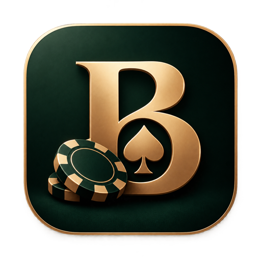

<p align="center">
  
</p>

# Banca

A multi-game social casino played with virtual chips: Texas Hold'em, blackjack and roulette, with opponents and coaches driven by a language model that decides by calling tools over the [Model Context Protocol](https://modelcontextprotocol.io). Their reasoning streams to the table as it happens, so you can watch an opponent work out its decision, or ask it to explain yours.

> **Play money only.** Chips are free, cannot be bought, cannot be cashed out, and have no value. Banca is not a gambling application and never handles real money.

**Play it:** [banca-xico.vercel.app](https://banca-xico.vercel.app). The server sleeps when nobody is playing, so the first table can take up to a minute to wake.

**Status:** in development, and playable from end to end.

- **Three games.** Texas Hold'em, blackjack against the house, and roulette on a European wheel.
- **Banca at every table.** At poker it is an opponent that decides by calling tools over MCP, its steps shown as it takes them and its full reasoning revealed once the hand is over. A second agent, given only your own cards and sharing nothing with the first, will coach you against it if you ask. At blackjack it is a coach: ask, and it tells you what it would do, why, and what each play is worth, and after the round it grades each decision you made and says what a mistake cost. At roulette there is nothing to coach, so it is an analyst: it tells you how often your layout wins, what it costs, and that no system changes either.
- **With other people, or alone.** Up to five players sit down with Banca at a poker table; several face one dealer at a blackjack table and act in turn against a clock; one wheel turns for everyone in a roulette room. Players see each other's chips and can chat. Every game also has a table to yourself.
- **Tables that outlive connections.** The server keeps the table, so a dropped connection or a reload finds your round as you left it.
- **One bankroll.** Chips, history and statistics belong to the player and follow them from table to table. Play as a guest at once, or sign in with Google to keep your profile and reach it from another device.
- **Chips cannot be bought.** A daily reward that grows with a streak, and a small stake from the house for a player who has run out, are the only ways to come by them without winning.
- **A profile built from real rounds.** Levels, achievements, a bankroll chart and statistics for each game, all worked out from the rounds actually played.
- **Weekly leagues.** Signed-in players are ranked each week by what they won at the tables, in five leagues from Bronze to Emerald. The top three go up and are paid a prize, and keep a dated trophy for good, shown on a public page anyone can open from the leaderboard.

- **A guide to each game.** The first time you sit down, Banca walks you through a real round, step by step. Skip it, or take it again from your profile.

- **Installs like an app.** Add it to a phone's home screen from the lobby and it opens full screen, with no store involved. It opens without a network too, and says it is waiting for one.

- **Built to be usable by more people.** Playable from a keyboard, nothing told by colour alone (red is hatched at roulette), and motion that steps aside when the system asks it to.

- **Mindful of your time.** After an hour in one sitting Banca mentions it and leaves the choice with you. Change the length or turn it off on your profile.

## Why it exists

Three games with three different shapes, which is what makes the architecture worth building:

| Game | Shape | The agent's role |
|---|---|---|
| Texas Hold'em | Turn-based, players against each other, hidden cards | Opponent |
| Blackjack | Turn-based, players against a fixed-rule dealer | Coach |
| Roulette | Simultaneous betting, one spin resolves everything | Analyst |

The agent is not a chatbot bolted to a game. It receives only what a player in its seat can see, calls tools to work out equity, pot odds and legal actions, and submits an action the server validates like any other. As a coach it is held to the same standard: what each blackjack play is worth is computed from the rules, not looked up, and its advice is only passed on if those figures agree. It runs against any tool-calling model: Ollama locally, or a free hosted tier.

## Architecture

```
backend/        Kotlin + Ktor, one process
  games/        poker, blackjack and roulette engines: pure Kotlin, no I/O
  sessions/     a private table at each game, and the view each seat is given
  ws/           WebSocket gateway, the register of live tables, shared rooms, chat
  agents/       the tool-calling loop, the MCP tools for each game, model providers
  players/      identity, the chip ledger, rewards, statistics, leagues
db/migrations/  the Postgres schema, applied in order
frontend/       React + TypeScript, installable as a PWA
docs/           the wire protocol and the design spec
```

- **The server owns the rules.** Game rules live in pure, framework-free modules with immutable state, so they can be tested exhaustively on their own. The client draws what it is sent and never decides an outcome.
- **Whole states, not deltas.** After every change each seat is sent its complete view, with nothing in it that seat may not see. A client can draw from the latest message alone, which is also what makes reconnecting simple.
- **The balance is a sum.** Every chip that moves is a line in an append-only ledger. Streaks, rewards, statistics, levels, achievements and league standings are all worked out from the ledger and the record of rounds; none of them is stored as a number that could drift.
- **The model is pluggable, and never trusted.** The agent talks to a `ModelProvider`, with Ollama and any OpenAI-compatible host behind it. Its tools are served over MCP inside the backend process. Whatever it submits is validated like a player's action, and a model that fails, stalls or answers nonsense is replaced by the safe play or by the figures.
- **Live tables are in memory.** Postgres holds what must last: players, the ledger, finished rounds, league results. A table lives in the server's memory, and a restart ends the rounds in play without charging for them.

The wire protocol is in [`docs/protocol.md`](docs/protocol.md) and the full design in [`docs/superpowers/specs`](docs/superpowers/specs/2026-09-27-banca-design.md).

## Stack

Kotlin, Ktor, WebSockets, PostgreSQL, React, TypeScript, Vite, Tailwind, MCP.

Everything runs on free tiers: Supabase for the database and sign-in, Render for the backend, Vercel for the frontend, GitHub Actions for CI, and for the agent Ollama locally and Groq's free tier when deployed.

## Running locally

You need JDK 21 or newer, Node 22, and [Ollama](https://ollama.com) with a tool-calling model for the opponent:

```bash
ollama pull qwen2.5:7b
```

`MODEL_PROVIDER` chooses who plays Banca: `ollama` (the default), `groq` with a `GROQ_API_KEY`, or `passive` to play without a model, in which case the opponent only checks and calls and the coach answers from the figures.

Players and their history are kept in Postgres when `DATABASE_URL` is set, with the migrations in [`db/migrations`](db/migrations) applied in order. Without it the server keeps them in memory and forgets them when it stops, which is enough to try the game. Settings are read from the environment, then from `backend/.env`.

Everyone can play as a guest. With `SUPABASE_URL` and `SUPABASE_ANON_KEY` set, and Google enabled as a provider in that Supabase project, players can also sign in to save their profile and reach it from another device.

```bash
cd backend && ./gradlew run
```

```bash
cd frontend && npm install && npm run dev
```

Then open http://localhost:5173. The backend listens on port 8080, and the frontend talks to it over the WebSocket described in [`docs/protocol.md`](docs/protocol.md).

Run the tests with `./gradlew test` in `backend/`, and `npm test` and `npm run lint` in `frontend/`. The Postgres store is tested as well when `TEST_DATABASE_URL` points at a database with the migrations applied; never point it at one whose data you want to keep.

## Author

Francisco Aragão Dias © [GitHub](https://github.com/xicoooooo) · [LinkedIn](https://www.linkedin.com/in/francisco-dias-78bb13205)
